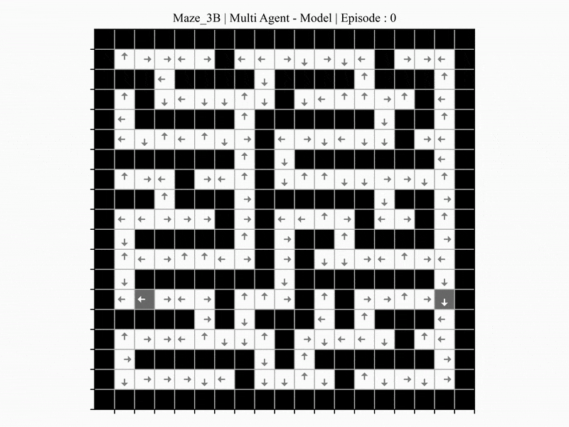

# EVALUATION OF A NEW MULTI-AGENT APPROACH ON MAZE PROBLEMS BASED ON THE Q-LEARNING ALGORITHM

BSc FINAL PROJECT SUBMITTED AS PART OF THE REQUIREMENTS FOR THE AWARD OF THE DEGREE IN COMPUTING AND INFORMATION SYSTEMS OF THE UNIVERSITY OF LONDON

## Project Overview

This project explores a novel multi-agent reinforcement learning (MARL) approach to solving maze problems using the Q-learning algorithm. Traditionally, maze-solving relies on a single agent to find the shortest path from a start to an end point. This project investigates the potential benefits of employing two agents working together to solve the maze by meeting at a dynamic intermediate goal state.

## Key Features

- **Multi-Agent System:** Two agents collaborate by starting from different ends of the maze and aiming to meet at a dynamically determined goal state.
- **Reinforcement Learning:** Based on the Q-learning algorithm to enable agents to learn the optimal paths through the maze.
- **Dynamic Goal State:** A novel concept where the goal state can change dynamically, enhancing the agents' ability to find efficient paths.

## Aims and Objectives

1. **Evaluate Performance:** Compare the efficiency and effectiveness of the multi-agent approach against traditional single-agent methods.
2. **Literature Integration:** Incorporate findings from existing research on maze-solving and reinforcement learning to provide a comprehensive analysis.
3. **Explore Multi-Agent Frameworks:** Provide an overview of common multi-agent approaches and their applicability to maze-solving.

## Experiments

A series of 10 different maze designs, of increasing size and difficulty, was selected for the system to solve. The reason for evaluating different scenarios is to make sure a particular scenario doesn’t benefit any of the approaches. This is a common practice on maze solving as can be seen in related literature. Their designs are carefully crafted to test the efficiency and adaptability of the algorithm.

## User Interface

It is not the intention of this project to provide a maze-solving application. However, it’s
been decided to implement a simple GUI that helps better control the system during the
experiments.

## Implementation

Python 3.8.5 has been used for the implementation of the system. The reason for this being that it already has a series of libraries and frameworks developed around it that have made its use on machine learning projects the most common practice nowadays.

| Library    | Version  | Function                                               |
| ---------- | -------- | ------------------------------------------------------ |
| OpenCV     | 4.4.0.46 | Graphic representation of maze solving                 |
| Matplotlib | 3.3.2    | Plotting results and graphs for evaluation             |
| Numpy      | 1.18.5   | Adding support to large arrays and matrices operations |
| Pillow     | 8.2.0    | Image manipulation                                     |

## Project Deliverables

1. **Literature Review:** Comprehensive review of the Q-learning algorithm, traditional maze-solving approaches, and multi-agent systems.
2. **Evaluation System:** A developed system with a user-friendly interface for testing different models on various maze designs.
3. **Experimental Results:** Comparative analysis through experiments, resulting in data and graphs that illustrate performance differences.
4. **Comprehensive Analysis:** In-depth discussion of the results, highlighting the advantages and potential improvements for the multi-agent approach.

## Results

- **Small Mazes:** Multi-agent approach shows superior performance in solving simple mazes efficiently.
- **Medium and Large Mazes:** Demonstrates significant adaptability and improved efficiency over traditional methods.
- **Special Designs:** Highlights scenarios where the new approach provides clear benefits.

## Future work

Despite the progress made, further work is required to fully realize the potential of the suggested algorithm. Key areas for future research include:

- **Algorithm Improvement:** Investigate why the multi-agent system occasionally fails to find the shortest path and refine the algorithm to prevent this by analyzing training sessions, adjusting parameters, and testing different reward structures.
- **Resource Analysis:** Conduct a detailed analysis of memory usage and processing power for both single-agent and multi-agent systems by benchmarking and profiling resource consumption across various maze complexities.
- **Distributed Processing:** Implement the multi-agent algorithm on separate processing units, develop communication protocols, and compare performance metrics like latency and throughput.
- **Complex Environments and Real-world applications":** Test the algorithm in varied scenarios to evaluate its robustness, including environments with intermediate goal states and dynamic obstacles, and extend the approach to more complex environments and real-world applications where unexpected obstacles may appear.
